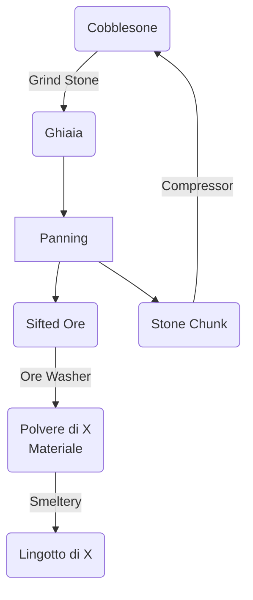

# Come Iniziare
L'obbiettivo di ogni OneBlock è quella di creare farm per ottenere materiali utili ad espandere la propria isola e la SlimeFun ci permette molto facilmente nelle prime fasi del gioco di produrre la maggior parte dei minerali necessari e altro.
Per arrivare a questo obiettivo possiamo sfruttare questo circolo vizioso dove: 

Compreso questo diagramma, possiamo iniziare a parlare dei macchinari:
- Grind Stone
  -    Tritura la Cobblestone in Ghiaia, metti la Cobblestone nel Dispenser e premi sulla Staccionata
- WIP

---
