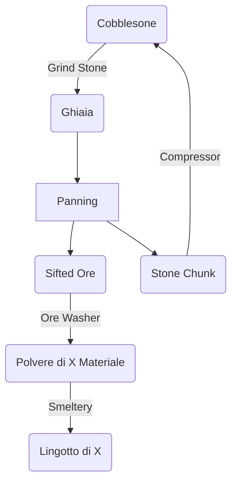

# Come Iniziare
L'obbiettivo di ogni OneBlock è quella di creare farm per ottenere materiali utili ad espandere la propria isola e la SlimeFun ci permette molto facilmente nelle prime fasi del gioco di produrre la maggior parte dei minerali necessari e altro.
Per arrivare a questo obiettivo possiamo sfruttare questo circolo vizioso dove: 

Compreso questo diagramma, possiamo iniziare a parlare dei macchinari:
- Grind Stone
  -    Tritura la Cobblestone in Ghiaia, metti la Cobblestone nel Dispenser e premi sulla Staccionata
- Automatic Panning Machine (o Gold Pan)
  -    Setaccia la Ghiaia in Sifted Ore      premendo sulla trapdoor
- Ore Washer
  -    Pulisce i Sifted Ore generando Polveri di Ores      e Stone Chunk      premendo sulla staccionata
- Smeltery
  -    Cuoce le polveri in lingotti premendo sulla staccionata.
- Compressor
  -    Comprime gli Stone Chunk in Cobblestone.

Un'altra struttura multiblocco utile per creare oggetti della SlimeFun è la Enhanced Crafting Table, mettendo gli oggetti richiesti nel dispenser e premendo sul banco da lavoro è possibile fare un crafting SlimeFun  
  

# Cosa ci serve
In totale avremo bisogno di:
- 36 Cobblestone
- 24 Assi di legna
- 12 Stringhe (per 4 Archi)
- 14 Netherrack
- 6 Redstone
- 10 Lingotti di Ferro
- 1 Flint

Per creare:
- 5 Dispenser
- 2 Staccionate di Legna
- 2 Staccionata di Nether Brick
- 2 Trapdoor di Legna
- 2 Pistoni
- 1 Calderone

# Il risultato finale

---
